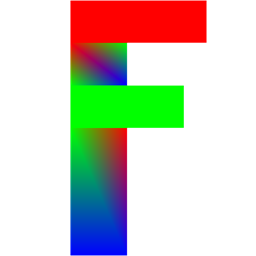

<div align="center">
    <a href="https://github.com/hqamhiyeh/learn-opengl-f">
        
    </a>
    <h3 align="center">Learn-OpenGL-F</h3>
    <p align="center">
        An example starter OpenGL project that draws a colorful, polygonal letter 'F' with GLFW & Glad.
        <br />
    </p>
</div>

## About the project

This project shows you an example of how to:

  * Create an OpenGL context and display a render window with GLFW
  * Load all required OpenGL rendering functions with Glad
  * Write basic vertex and fragment shaders with GLSL
  * Create a shader program; compile the shaders at run-time
  * Create vertex and index buffers, and fill the buffers with input data
  * Finally, render and draw to screen

The code is multi-platform and runs on Windows, Linux, and MacOS.

## Screenshots

<p float="left">
  
   
</p>

## Why 'F'?

The 'F' is inspired by a comment chain on the LearnOpenGL.com website where developers are posting their beginner OpenGL 'F' creations:

A commenter (6 years ago now from when this was written) had posted a screenshot of a OpenGL creation they had just made as practice; the screenshot exhibits a capital 'F' made up of red and green triangles. The comment since then has inadvertently started a trend in the comment section that has people replying with their own versions of the letter 'F' as they come across it, each with a unique take resulting in all combinations of shapes, colors, and sizes.

Check it out by scrolling down to the comment section on [this page](https://learnopengl.com/Getting-started/Hello-Triangle).

This project is my fun contribution, but also serves as a good starter OpenGL project with GLFW, Glad, and CMake.

## What are the requirements?

You will need [CMake](https://cmake.org/download/) to generate the files needed for building the project on your particular system.

## How do I download it?

The best way is to use git clone with the recursive option because the repository includes GLFW as a submodule; this ensures that the GLFW repository is downloaded as well:
```
git clone --recursive https://github.com/hqamhiyeh/learn-opengl-f
```

## How do I build it?

Open a terminal in the downloaded `learn-opengl-f` directory.

Create a new directory called `build`:

```
mkdir build
```

Change directory to the newly created `build` directory:

```
cd build
```

Run `cmake` for the parent directory:

```
cmake ..
```

Then...


For Linux & MacOS with make:

```
make all
```

For Windows with MinGW:

```
mingw32-make
```

For Windows with Visual Studio, open the generated `learn-opengl-f.sln` file and build the startup project.

## Usage

`Space` Toggle **Fill** / **Line** polygon modes

`Esc` Exit